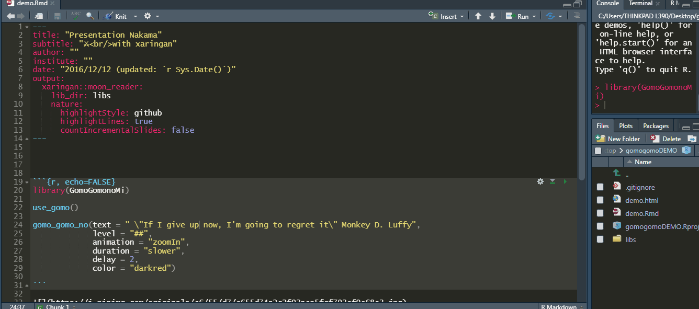

<!-- README.md is generated from README.Rmd. Please edit that file -->

```{r, include = FALSE}
knitr::opts_chunk$set(
  collapse = TRUE,
  comment = "#>",
  fig.path = "man/figures/README-",
  out.width = "100%"
)
```

# GomoGomonoMi <a></a>

<!-- badges: start -->
<!-- badges: end -->


The GomoGomonoMi packages allows you to animate text in Rmd documents (xaringan slides included) and Shiny apps using the [Animate.css](https://animate.style/) library. 


<center>


</center>


## Installation

You can install the development version of `GomoGomonoMi` from Github with:


```{r, eval=FALSE}

install.packages("remotes")

remotes::install_github("feddelegrand7/GomoGomonoMi")

```

## How to use it ? 

Put the `use_gomo()` function at the beginning of your Rmd document or Shiny application (at the UI): 

```{r}

library(GomoGomonoMi)

use_gomo()

```

Then you can animate your text using the `gomo_gomo_no()` function. Don't hesitate to use `help("gomo_gomo_no")` to check out additional arguments.


```{r, eval=FALSE}
library(GomoGomonoMi)

use_gomo()

gomo_gomo_no(text = " \"If I give up now, I'm going to regret it\" Monkey D. Luffy", 
             level = "##", 
             animation = "zoomIn", 
             duration = "slower", 
             delay = 2, 
             color = "darkred")

```





For a listing of all the available animations provided by the __Animate.css__ library, use the following function: 


```{r}

available_animations()


```


# Example 

This is an example of a Shiny app that uses `GomoGomonoMi`


```{r, eval=FALSE}

library(shiny)
library(GomoGomonoMi)

ui <- fluidPage(use_gomo(), 
                
                
  gomo_gomo_no(text = "HELLO SHINY !!!!", level = "#", animation = "backInDown", duration = "slower")
            

)

server <- function(input, output) {


}

shinyApp(ui = ui, server = server)


```


## Code of Conduct

<center>

</center>

Please note that the GomoGomonoMi project is released with a [Contributor Code of Conduct](https://contributor-covenant.org/version/2/0/CODE_OF_CONDUCT.html). By contributing to this project, you agree to abide by its terms.


