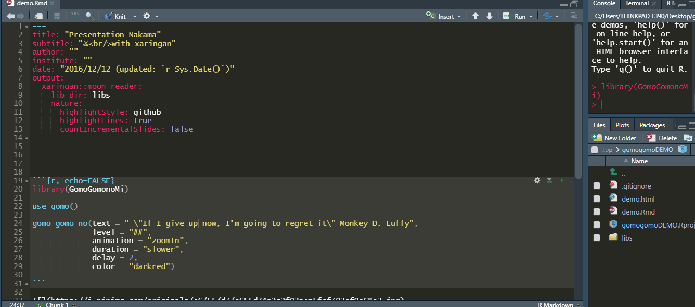
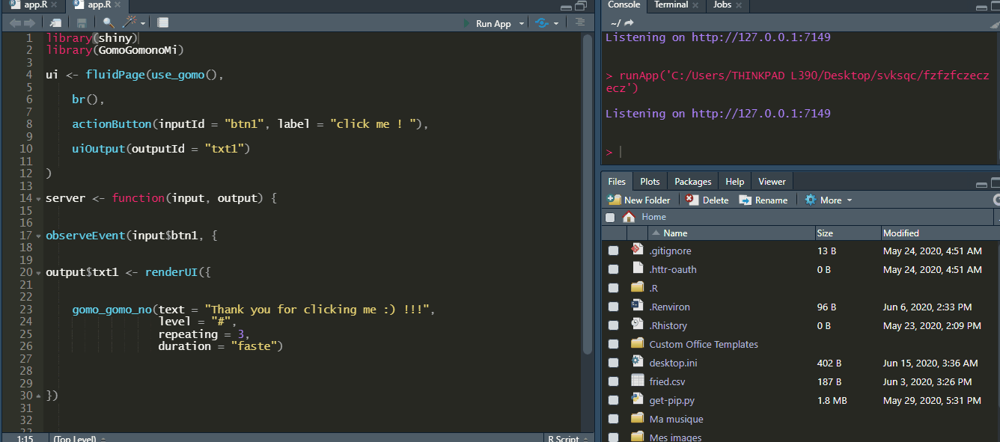

<!-- README.md is generated from README.Rmd. Please edit that file -->

# GomoGomonoMi <a></a>

<!-- badges: start -->

[](https://cran.r-project.org/package=GomoGomonoMi)
[](https://cran.r-project.org/package=GomoGomonoMi)
[](https://cran.r-project.org/package=GomoGomonoMi)
[](https://cran.r-project.org/package=GomoGomonoMi)
[](https://choosealicense.com/licenses/mit/)
[](https://github.com/feddelegrand7/GomoGomonoMi/actions)
[](https://github.com/feddelegrand7/GomoGomonoMi)

<!-- badges: end -->

The GomoGomonoMi packages allows you to animate text in Rmd documents
(xaringan slides included) and Shiny apps using the
[Animate.css](https://animate.style/) library.


## Installation

You can install the `GomoGomonoMi` package from CRAN with:

``` r
install.packages("GomoGomonoMi")
```

You can install the development version of `GomoGomonoMi` from Github
with:

``` r
install.packages("remotes")

remotes::install_github("feddelegrand7/GomoGomonoMi")
```

## How to use it ?

Put the `use_gomo()` function at the beginning of your Rmd document or
Shiny application (at the UI). **This function needs to be run only
once** :

``` r
library(GomoGomonoMi)
#> Warning: package 'GomoGomonoMi' was built under R version 4.0.3

use_gomo()
```

<!--html_preserve-->
<head>

<link
  rel='stylesheet'
  href='https://cdnjs.cloudflare.com/ajax/libs/animate.css/4.0.0/animate.min.css'
/>

</head>
<!--/html_preserve-->

Then you can animate your text using the `gomo_gomo_no()` function.
Don’t hesitate to use `help("gomo_gomo_no")` to check out additional
arguments.

``` r
library(GomoGomonoMi)

use_gomo()

gomo_gomo_no(text = " \"If I give up now, I'm going to regret it\" Monkey D. Luffy", 
             level = "##", 
             animation = "zoomIn", 
             duration = "slower", 
             delay = 2, 
             color = "darkred")
```



For a listing of all the available animations provided by the
**Animate.css** library, use the following function:

``` r
available_animations()
#> $attention_seekers
#>  [1] "bounce"     "flash"      "pulse"      "rubberBand" "shakeX"    
#>  [6] "shakeY"     "headShake"  "swing"      "tada"       "wobble"    
#> [11] "jello"      "heartBeat" 
#> 
#> $back_entrances
#> [1] "backInDown"  "backInLeft"  "backInRight" "backInUp"   
#> 
#> $back_exits
#> [1] "backOutDown"  "backOutLeft"  "backOutRight" "backOutUp"   
#> 
#> $bouncing_entrances
#> [1] "bounceIn"      "bounceInDown"  "bounceInLeft"  "bounceInRight"
#> [5] "bounceInUp"   
#> 
#> $bouncing_exits
#> [1] "bounceOut"      "bounceOutDown"  "bounceOutLeft"  "bounceOutRight"
#> [5] "bounceOutUp"   
#> 
#> $fading_entrances
#>  [1] "fadeIn"            "fadeInDown"        "fadeInDownBig"    
#>  [4] "fadeInLeft"        "fadeInLeftBig"     "fadeInRight"      
#>  [7] "fadeInRightBig"    "fadeInUp"          "fadeInUpBig"      
#> [10] "fadeInTopLeft"     "fadeInTopRight"    "fadeInBottomLeft" 
#> [13] "fadeInBottomRight"
#> 
#> $fading_exits
#>  [1] "fadeOut"            "fadeOutDown"        "fadeOutDownBig"    
#>  [4] "fadeOutLeft"        "fadeOutLeftBig"     "fadeOutRight"      
#>  [7] "fadeOutRightBig"    "fadeOutUp"          "fadeOutUpBig"      
#> [10] "fadeOutTopLeft"     "fadeOutTopRight"    "fadeOutBottomRight"
#> [13] "fadeOutBottomLeft" 
#> 
#> $flippers
#> [1] "flip"     "flipInX"  "flipInY"  "flipOutX" "flipOutY"
#> 
#> $lightspeed
#> [1] "lightSpeedInRight"  "lightSpeedInLeft"   "lightSpeedOutRight"
#> [4] "lightSpeedOutLeft" 
#> 
#> $rotating_entrances
#> [1] "rotateIn"          "rotateInDownLeft"  "rotateInDownRight"
#> [4] "rotateInUpLeft"    "rotateInUpRight"  
#> 
#> $rotating_exits
#> [1] "rotateOut"          "rotateOutDownLeft"  "rotateOutDownRight"
#> [4] "rotateOutUpLeft"    "rotateOutUpRight"  
#> 
#> $specials
#> [1] "hinge"        "jackInTheBox" "rollIn"       "rollOut"     
#> 
#> $zooming_entrances
#> [1] "zoomIn"      "zoomInDown"  "zoomInLeft"  "zoomInRight" "zoomInUp"   
#> 
#> $zooming_exits
#> [1] "zoomOut"      "zoomOutDown"  "zoomOutLeft"  "zoomOutRight" "zoomOutUp"   
#> 
#> $sliding_entrances
#> [1] "slideInDown"  "slideInLeft"  "slideInRight" "slideInUp"   
#> 
#> $sliding_exits
#> [1] "slideOutDown"  "slideOutLeft"  "slideOutRight" "slideOutUp"
```

# Shiny Examples

This is an example of a Shiny app that uses `GomoGomonoMi`

``` r
library(shiny)
library(GomoGomonoMi)

ui <- fluidPage(use_gomo(), 
                
                
  gomo_gomo_no(text = "HELLO SHINY !!!!", level = "#", animation = "backInDown", duration = "slower")
            

)

server <- function(input, output) {


}

shinyApp(ui = ui, server = server)
```

You can also leverage the reactivity in shiny to animate some texts
using `GomoGomonoMi`:

``` r
library(shiny)
library(GomoGomonoMi)

ui <- fluidPage(use_gomo(), 
    
    br(),
    
    actionButton(inputId = "btn1", label = "click me ! "), 
    
    uiOutput(outputId = "txt1")
   
)

server <- function(input, output) {
    
observeEvent(input$btn1, {
    
    
output$txt1 <- renderUI({
    
    
    gomo_gomo_no(text = "Thank you for clicking me :) !!!", 
                 level = "#", 
                 repeating = 3, 
                 duration = "faste")

    
})
    
})

}

shinyApp(ui = ui, server = server)
```



## Code of Conduct

<center>

</center>

Please note that the GomoGomonoMi project is released with a
[Contributor Code of
Conduct](https://contributor-covenant.org/version/2/0/CODE_OF_CONDUCT.html).
By contributing to this project, you agree to abide by its terms.
